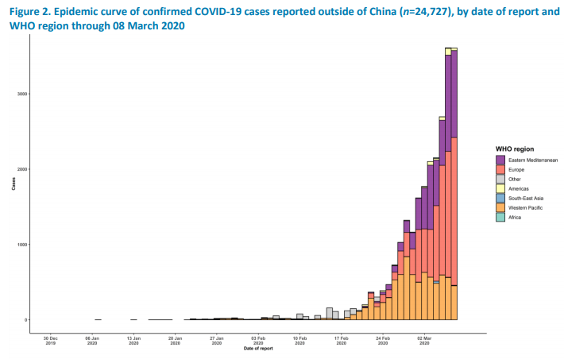
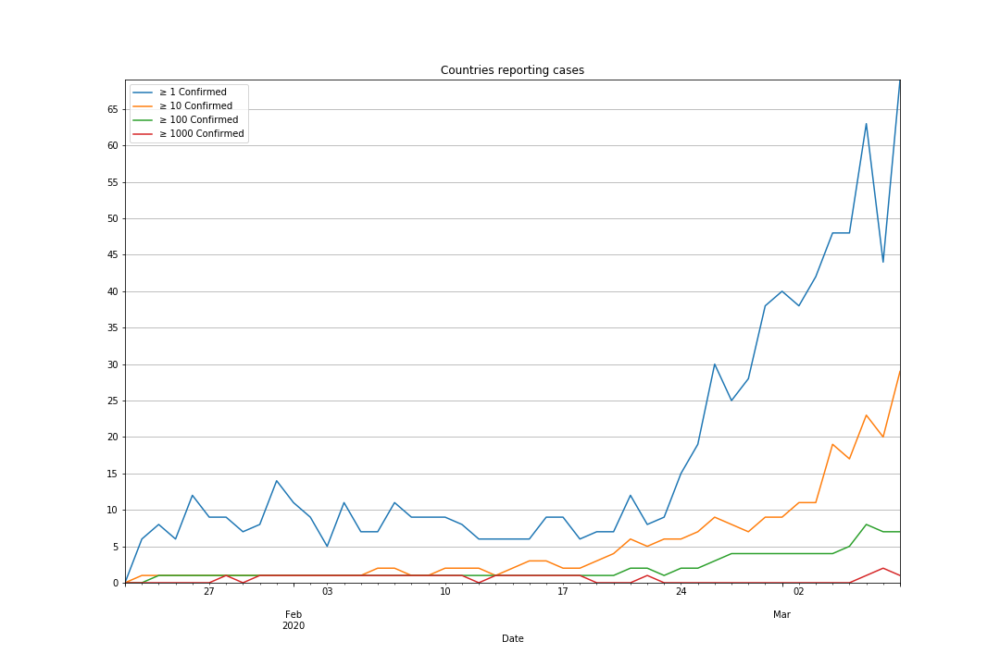
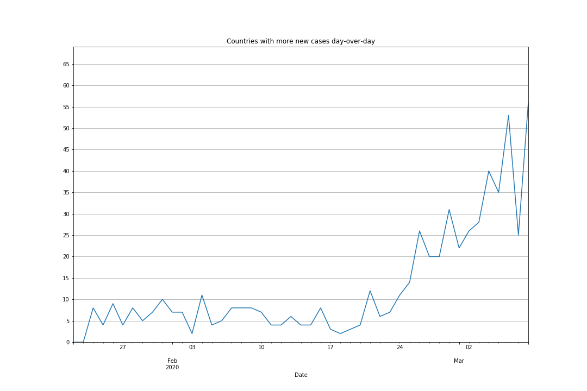

# COVID-19 Pandemic Forecast
by [Alex Beal](https://twitter.com/beala) and [Nick Vanderweit](https://twitter.com/nvanderw)

We are non-experts with an interest in forecasting world events. Our approach is to first determine a prior probability given past events, and update that probability with current evidence. The calculations below use the odds form of Bayes’ theorem.
# Definition of pandemic
We define a coronavirus pandemic as an event where > 10% of the world is infected by coronavirus before 2022. In this forecast, we focus on how prevalent we believe the coronavirus outbreak will become, although we use the estimated fatality rate to make some estimates about prevalence.
# Prior probability
We estimate the prior probability of a pandemic given an outbreak of this size by looking at historical cases of outbreaks of this size. Below are outbreaks of respiratory viruses causing more than 1,000 confirmed cases.

| Not Pandemic | Pandemic |
|--------------|----------|
| [MERS](https://en.wikipedia.org/wiki/Middle_East_respiratory_syndrome) (2018)  | [H1N1](https://en.wikipedia.org/wiki/Influenza_A_virus_subtype_H1N1) (2009)|
| [H1N1](https://en.wikipedia.org/wiki/2015_Indian_swine_flu_outbreak) (India, 2015): Since H1N1 had already become seasonal, it’s unclear if this ever had the potential to become a pandemic.| [London Flu](https://en.wikipedia.org/wiki/London_flu) (1972): Thousands of deaths, outbreaks in several countries, but unclear what percentage of the world it infected. |
| [SARS](https://en.wikipedia.org/wiki/Severe_acute_respiratory_syndrome) (2003)        |  [Hong Kong Flu](https://en.wikipedia.org/wiki/1968_flu_pandemic) (1968) |
| [Russian Flu](https://en.wikipedia.org/wiki/Influenza_A_virus_subtype_H1N1) (1977) | [Asian Flu](https://en.wikipedia.org/wiki/Influenza_A_virus_subtype_H2N2#Asian_flu) (1956) |
|                    | Spanish Flu (1918) |

It’s unclear if Russian Flu and the 2015 Indian H1N1 outbreak should be included, as they were both outbreaks of viruses that were either already in circulation, or had been in circulation in the past.

It’s also unclear if London Flu ever went on to infect a significant percentage of the world, or if the outbreaks across several countries were small.

It’s also true that MERS and SARS never got nearly to the size of the current outbreak. We include them because they’re the only large outbreaks to be contained in the 21st century.

**Including all instances, our prior is 5:4 odds that an outbreak of this size will become a pandemic.**

**If we exclude questionable instances (Indian H1N1, Russian Flu, and London Flu), our prior is 2:1.**

Some commenters have expressed concern about undersampling contained viruses. However these data would also undersample mild infections that spread widely e.g. known coronaviruses already in circulation that cause colds. So it is unclear to us how to update on this.

There has also been concern about what time range to consider, especially given that the data shows no non-pandemic cases for most of the 1900s. Perhaps advances in gene sequencing and other diagnostic technology give us reasons to give more weight to more recent data. Considering only cases since 2000, (SARS, MERS, and H1N1), we get a **1:2 prior**.

**Our priors range from 1:2 at the low end to 2:1 at the high end.**

# Evidence for pandemic

## Global spread of COVID-19 cases
In the last update, there were only 18 confirmed cases in Iran. We predicted 400 to 1,300 total cases on February 22nd based on the ratio of confirmed deaths to confirmed cases. Over time, [the ratio of deaths to confirmed cases](http://share.usrsb.in/covid19/#deaths_confirmed_ratio_vs_time.png) has dropped.
As of March 8th, [the WHO has confirmed](https://www.who.int/docs/default-source/coronaviruse/situation-reports/20200308-sitrep-48-covid-19.pdf?sfvrsn=16f7ccef_4) 5,823 cases in Iran with 145 deaths, a CFR of around 2.5%, which is more in line with reports from other countries. This suggests that detection efforts have ramped up in Iran and they are catching up to the scale of the community spread.

Since the last update on Feb 22nd, cases have grown worldwide, especially in South Korea, Japan, Italy, and Iran.

From February 22nd to March 8th, confirmed cases outside of China have grown from 1,402 to 24,727. Deaths outside of China have grown from 11 to 484.

The number of countries reporting at least one case, at least ten cases, and at least a hundred cases are growing.

The number of countries reporting more new cases day-over-day is increasing. These are countries where the number of new cases on a given day is greater than the number of new cases on the previous day.

The contagion is now worldwide and there is more than an order of magnitude more cases, which should increase our credence that it will become a global pandemic as defined in this forecast.

**TODO: put an update on this.**

## Undetected cases
Based on air travel estimates and Iran's extremely high reported CFRs, we previously believed there was evidence of undetected transmission. Since then the evidence has grown that even developed countries are not adequately detecting the spread of COVID-19. A research team led by Trevor Bedford [identified a single transmission chain](https://bedford.io/blog/ncov-cryptic-transmission/) that is estimated to have infected 570 people in Washington state. As of March 7th, the CDC had reportedly tested [1,583 people *total*](https://thehill.com/homenews/administration/486452-cdc-has-tested-1583-people-for-coronavirus), while South Korea has been testing roughly [10,000 people *per day*](https://www.cdc.go.kr/board/board.es?mid=&bid=0030). It has become clear that there are vast disparities between even developed countries in their ability to monitor the spread of COVID-19. We infer:

1. That the number of confirmed cases reported by the WHO most likely significantly understates the spread of COVID-19.
2. Lack of effective diagnostics will make it more difficult for countries to identify and respond to hotspots.
3. Even if some countries like South Korea are able to effectively scale up their efforts to diagnose and contain the spread of COVID-19, they are still imperiled by a global spread of the disease in countries less able to respond.

**TODO: put an update on this.**

# Evidence against pandemic
## The outbreak in China may be peaking
The official numbers coming out of China suggest that the outbreak inside China may be peaking. If an outbreak inside China can be contained, that’s a signal that China’s tactic of large scale quarantine is effective even with case numbers in the tens of thousands. Other countries may be able to deploy a similar tactic against their outbreaks should they occur.

That said, we have ample reason to be skeptical.

- Given the political pressures to drive down the number of cases, and the constant changing case definitions, it’s hard to be sure the trend is real. We can’t rule out disinformation given the [political climate in China](https://www.latimes.com/world-nation/story/2020-02-11/china-coronavirus-peoples-war).
- Even if cases are brought to a very low number, China must at some point end the quarantine which could lead to a second wave. China must eliminate the virus completely for this to be effective.

**We don’t see this as a likely way for the outbreak to end, but it may buy the world time to develop a vaccine, treatment, or better surveillance, so we give it a 4:5 update.**

## Development of an effective vaccine or antiviral
Given the possibility of pandemic, governments and private companies are incentivized to create vaccines and treatments. There are some potentially promising avenues:

- [Remdesivir prevents MERS coronavirus disease in monkeys | National Institutes of Health](https://www.nih.gov/news-events/news-releases/remdesivir-prevents-mers-coronavirus-disease-monkeys)
- [The coronavirus prompts a burst of clinical trials in search of a treatment](https://www.statnews.com/pharmalot/2020/02/19/coronavirus-clinical-trials-china/)
- Use of an HIV antiviral cocktail to treat the SARS coronavirus in patients: [Role of lopinavir/ritonavir in the treatment of SARS: initial virological and clinical findings.](https://www.ncbi.nlm.nih.gov/pubmed/14985565)

While we would expect to see a flurry of research into such avenues regardless of whether they were destined for success, it is not out of the question that advances in antiviral R&D for coronaviruses would produce mitigations for COVID-19. However in the world of pharmaceutical development, there is a huge difference between a promising initial trial and large-scale distribution of an effective treatment to hundreds of thousands or millions of people.

[One report](https://academic.oup.com/biostatistics/article/20/2/273/4817524) estimates that 9.6% of Phase 1 trials will eventually be deemed safe and effective. There are > 120 clinical trials happening for COVID-19, so it is possible that some of the treatments will be effective. However, we have reasons to suspect that the success rate of these trials will be lower than standard Phase 1 base rates. Due to the desperate situation in China, where the vast majority of these trials are happening, it is plausible that many clinical trials are being conducted that would not have advanced to the clinical trial stage in other circumstances. Hence we should expect a lower probability that a given trial will succeed here, assuming say 1%. Additionally, for this to reduce the chance of pandemic, the successful trial would have to be a treatment that slows or stops the spread. The treatment would have to be manufactured on a large scale and distributed to many countries with varying quality of healthcare infrastructure, and the trials, manufacture, and distribution would have to happen before the outbreak of a pandemic in order to prevent one from occurring.

Given that, in the H1N1 case, it was mere months between the first outbreaks outside of Mexico and declarations of pandemic, we think it’s very unlikely that a given treatment will arrive in time to prevent pandemic. **Our Bayesian update for this is 99:100.**

# Posterior Probability

**TODO: Recalculate this**

| Prior odds | 5:4 | 2:1 | 1:2 |
|--|--|--|--|
| Undetected cases | 4:1 | | |
| No large outbreak outside of China|3:4| | |
| China outbreak peaking | 4:3 | | |
|Development of effective vaccine or antiviral | 99:100| | |
|Combined update | 297:125 ~= 2.376 | | |
| Posterior odds |297:100 ~= 75% | 594:125 ~= 83%| 297:250 ~= 54%|

# What would change our minds
## Countries that we expect to have oubreaks continue to have a low number of cases
Originally we estimated that an outbreak with over 1,000 cases should be detected. However, given the outbreaks in Italy, Iran and the US, we now have evidence that outbreaks can go undetected into the thousands of cases if the government is not looking. For example, [researchers have estimated 570 cases](https://hangouts.google.com/_/elUi/chat-redirect?dest=https%3A%2F%2Fbedford.io%2Fblog%2Fncov-cryptic-transmission%2F) originating from a single transmission chain in Washington. These were not detected by the CDC, but instead detected by independent researchers. So even in developed countries with good public health infrastrucuture, the government can miss transmission chains. India, for example, has only tested 3,404 individuals as of March 6th. In per capita terms, that's less testing that even the US, whose testing failures have been widely publicized.

As a result of low testing capacity, many countries have instituted testing protocols that only test travelers from China, South Korea, Iran, and Italy. For example, up until March 4th, [the US was only testing cases](https://web.archive.org/web/20200228190030/https://www.cdc.gov/coronavirus/2019-ncov/hcp/clinical-criteria.html?CDC_AA_refVal=https%3A%2F%2Fwww.cdc.gov%2Fcoronavirus%2F2019-ncov%2Fhcp%2Fidentify-assess-flowchart.html) with links to either an affected country or another confirmed case or the case is severe enough to require hospitalization. Since then, the official guidance has been for clinicians to use their judgement. This testing strategy would miss cases of community transmission or importations from countries that aren't covered by testing protocols.

However, the more time that passes, the less likely it is that cases can go undetected. For instance, if a given country has a thousand undetected cases, with a doubling time of about a week, there should be 16,000 cases a month later and 256,000 cases two months later. As time goes on, it becomes exponentially less likely that there are undetected transmission chains. If by April there are few detected cases then it's very unlikely these countries have outbreaks.

## Outbreaks outside of China are contained
One assumption of this forecast is that undetected cases can lead to large outbreaks that cannot be stopped once they’re detected. If instead these outbreaks are quickly stopped, that would be a signal countries are significantly better at responding to these outbreaks that we anticipated.

As of February 21, we are starting to see widespread outbreaks in Iran, and a worrying spike in cases in South Korea, possibly both caused by undetected lines of transmission. We’ll be watching to see how quickly these can be contained, if at all. If they are contained that leaves open the possibility of a middle ground scenario where we see new outbreaks regularly, but they are stopped quickly.

One cause for concern is that we expect there to be a high variance in how effective countries are at responding to an outbreak, and it may only require a few countries with a low ability to respond to spread the virus to the rest of the world.
